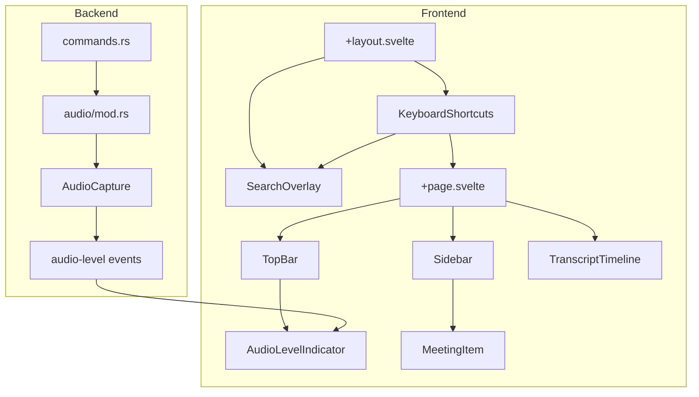

# UI/UX Improvements Plan for Phantom Ear

## Overview

This plan outlines the implementation of 6 UI/UX improvements for Phantom Ear, a privacy-first meeting transcription app.

---

## Feature 1: Global Hotkey to Start/Stop Recording

### Description
Allow users to start/stop recording from anywhere in the app using a keyboard shortcut.

### Technical Approach

#### Frontend (Svelte)
- Create a new keyboard shortcut composable: `src/lib/composables/useKeyboardShortcut.ts`
- Register global event listener in `+page.svelte` or `+layout.svelte`
- Default shortcut: `Cmd+Shift+R` (macOS) / `Ctrl+Shift+R` (Windows)

#### Implementation Details

```typescript
// src/lib/composables/useKeyboardShortcut.ts
export function useKeyboardShortcut(
  key: string,
  callback: () => void,
  options?: { ctrl?: boolean; shift?: boolean; alt?: boolean; meta?: boolean }
)
```

#### Files to Modify
- `src/routes/+page.svelte` - Add keyboard listener
- `src/lib/components/TopBar.svelte` - Show shortcut hint in UI

#### User Experience
- Show toast notification when recording starts/stops via shortcut
- Display shortcut in TopBar recording button tooltip

---

## Feature 2: Quick Search (Cmd+K Style)

### Description
A spotlight-style search overlay for quickly finding meetings, searching transcripts, and navigating the app.

### Technical Approach

#### New Components
- `src/lib/components/SearchOverlay.svelte` - Main search modal
- `src/lib/stores/search.svelte.ts` - Search state management

#### Features
- Search meetings by title
- Search within transcripts
- Quick actions (Start Recording, Settings, etc.)
- Keyboard navigation within results (↑/↓/Enter/Esc)

#### Implementation Details

```svelte
<!-- SearchOverlay.svelte structure -->
<div class="search-overlay">
  <input placeholder="Search meetings, transcripts..." />
  <div class="search-results">
    {#each results as result}
      <SearchResultItem {result} />
    {/each}
  </div>
  <div class="search-hints">
    <span>↑↓ to navigate</span>
    <span>Enter to select</span>
    <span>Esc to close</span>
  </div>
</div>
```

#### Files to Create/Modify
- `src/lib/components/SearchOverlay.svelte` (new)
- `src/lib/stores/search.svelte.ts` (new)
- `src/routes/+layout.svelte` - Add SearchOverlay component
- `src/routes/+page.svelte` - Register Cmd+K shortcut

---

## Feature 3: Keyboard Navigation for Meetings

### Description
Navigate the sidebar and meeting list using keyboard shortcuts.

### Technical Approach

#### Shortcuts
- `Cmd+B` - Toggle sidebar
- `↑/↓` - Navigate meeting list (when sidebar focused)
- `Enter` - Select meeting
- `Delete/Backspace` - Delete selected meeting (with confirmation)

#### Implementation Details

```typescript
// In Sidebar.svelte
function handleKeydown(e: KeyboardEvent) {
  if (e.key === 'ArrowDown') {
    selectedIndex = Math.min(selectedIndex + 1, meetings.length - 1);
  } else if (e.key === 'ArrowUp') {
    selectedIndex = Math.max(selectedIndex - 1, 0);
  } else if (e.key === 'Enter') {
    selectMeeting(meetings[selectedIndex]);
  }
}
```

#### Files to Modify
- `src/lib/components/Sidebar.svelte` - Add keyboard navigation
- `src/lib/components/MeetingItem.svelte` - Add selected state styling

---

## Feature 4: Real-Time Audio Level Display

### Description
Show a real-time audio waveform/level indicator during recording to confirm audio is being captured.

### Technical Approach

#### Backend Changes (Rust)
- Modify `AudioCapture` to expose current audio level
- Add new Tauri command: `get_audio_level` returning RMS or peak level
- Add Tauri event: `audio-level` emitted periodically (e.g., 60fps)

```rust
// In audio/mod.rs
pub fn get_rms_level(&self) -> f32 {
    if let Ok(samples) = self.samples.lock() {
        let recent: Vec<f32> = samples.iter().rev().take(1024).cloned().collect();
        let sum: f32 = recent.iter().map(|s| s * s).sum();
        (sum / recent.len() as f32).sqrt()
    } else {
        0.0
    }
}
```

#### Frontend Changes
- Create `AudioLevelIndicator.svelte` component
- Subscribe to `audio-level` events during recording
- Display animated bars or waveform

#### New Component Structure

```svelte
<!-- AudioLevelIndicator.svelte -->
<div class="audio-level-indicator">
  {#each bars as bar}
    <div class="bar" style="height: {bar}%"></div>
  {/each}
</div>
```

#### Files to Create/Modify
- `src-tauri/src/audio/mod.rs` - Add get_rms_level method
- `src-tauri/src/commands.rs` - Add get_audio_level command
- `src/lib/components/AudioLevelIndicator.svelte` (new)
- `src/lib/components/TopBar.svelte` - Integrate indicator

---

## Feature 5: Visual Timeline of Transcript Segments

### Description
Display a visual timeline showing when each transcript segment occurred during the recording.

### Technical Approach

#### Component Structure
- Timeline container scaled to recording duration
- Each segment represented as a colored block positioned by timestamp
- Current playback/position indicator

#### Implementation Details

```svelte
<!-- TranscriptTimeline.svelte -->
<script>
  export let segments: TranscriptSegment[];
  export let duration: number; // in seconds
  export let currentPosition: number; // in seconds
</script>

<div class="timeline">
  <div class="timeline-track">
    {#each segments as segment}
      <div 
        class="segment" 
        style="left: {(segment.timestamp_ms / 1000 / duration) * 100}%; 
               width: {(segment.duration_ms / 1000 / duration) * 100}%"
      >
        {segment.text}
      </div>
    {/each}
  </div>
  <div class="playhead" style="left: {(currentPosition / duration) * 100}%"></div>
</div>
```

#### Files to Create/Modify
- `src/lib/components/TranscriptTimeline.svelte` (new)
- `src/routes/+page.svelte` - Add timeline below transcript

---

## Feature 6: Click-to-Jump on Waveform/Timeline

### Description
Allow users to click on the timeline to jump to that point in the transcript view.

### Technical Approach

#### Implementation
- Add click handler to timeline
- Calculate clicked position as percentage
- Scroll transcript to nearest segment
- Highlight the jumped-to segment

#### Code Example

```svelte
<script>
  function handleTimelineClick(e: MouseEvent) {
    const rect = timelineEl.getBoundingClientRect();
    const clickPercent = (e.clientX - rect.left) / rect.width;
    const targetTime = clickPercent * duration;
    
    // Find nearest segment
    const nearestSegment = segments.reduce((prev, curr) => 
      Math.abs(curr.timestamp_ms / 1000 - targetTime) < Math.abs(prev.timestamp_ms / 1000 - targetTime)
        ? curr
        : prev
    );
    
    // Scroll to segment
    scrollToSegment(nearestSegment.id);
  }
</script>
```

#### Files to Modify
- `src/lib/components/TranscriptTimeline.svelte` - Add click handler
- `src/routes/+page.svelte` - Add scroll-to-segment function

---

## Implementation Order

Recommended order based on dependencies and complexity:

1. **Feature 1: Global Hotkey** - Simplest, no dependencies
2. **Feature 3: Keyboard Navigation** - Enhances sidebar usability
3. **Feature 2: Quick Search** - Larger component, builds on keyboard patterns
4. **Feature 4: Audio Level Display** - Requires backend changes
5. **Feature 5: Visual Timeline** - New visualization component
6. **Feature 6: Click-to-Jump** - Extends Feature 5

---

## Architecture Diagram



---

## CSS Variables to Add

Add to `src/app.css`:

```css
/* Search overlay */
--phantom-ear-overlay-bg: rgba(0, 0, 0, 0.7);
--phantom-ear-search-bg: var(--phantom-ear-surface);
--phantom-ear-search-highlight: var(--phantom-ear-accent);

/* Audio level indicator */
--phantom-ear-audio-bar: var(--phantom-ear-danger);

/* Timeline */
--phantom-ear-timeline-bg: var(--phantom-ear-surface);
--phantom-ear-timeline-segment: var(--phantom-ear-accent);
--phantom-ear-timeline-playhead: var(--phantom-ear-danger);
```

---

## Testing Checklist

- [ ] Global hotkey works from any view
- [ ] Search finds meetings by title
- [ ] Search finds text within transcripts
- [ ] Keyboard navigation cycles through meetings
- [ ] Audio level responds to microphone input
- [ ] Timeline correctly positions segments
- [ ] Click-to-jump scrolls to correct segment
- [ ] All features work in both light and dark themes
